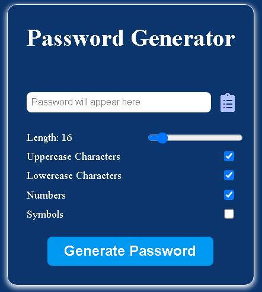

# Password-Generator
Simple **web based** *Password Generator* that includes:

    - Length,
    - Uppercase and Lowercase characters,
    - Numbers and
    - Symbols.

You can check out the live version [here](http://www.badnja.com/c/passgen/).

## What I Learned
Below are listed thing i learned in this challenge (links provided after the list):

    - Working with Javascript objects.
    - Generating and initializing options mentioned in the beginning of the file using Javascript browser character set.
    - Working with Arrays of Objects while forwarding checked options to other functions.
    - Initializing password with password seed based on selected options.
    - Generating password using pseudo-random generated lengths for adding certain character of specific option, e.g. if there is upper character option checked, generator will take calculated values of current password length and password length value (specified by user on the slider), and apply that calculation on `Math.Floor(Math.Random())` Javascript functions.
    - Shuffling generated password using Fisher-Yates algorithm.
    - Creating messages options for certain situations, invoking `setTimeout()` for certain amount time (after which message dissapears) and breaking it on user interruption, and also calling them on certain user actions, e.g. when user tries to generate password but didn't check any options.

**Links:**

- [character set](https://net-comber.com/charset.html)
- [Fisher-Yates algorithm](https://en.wikipedia.org/wiki/Fisher%E2%80%93Yates_shuffle)
